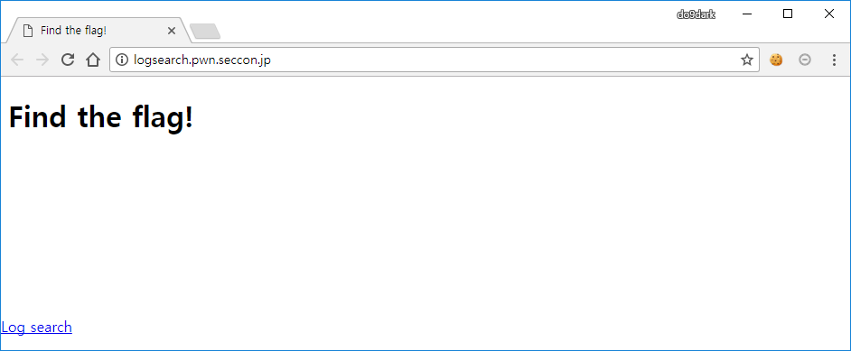
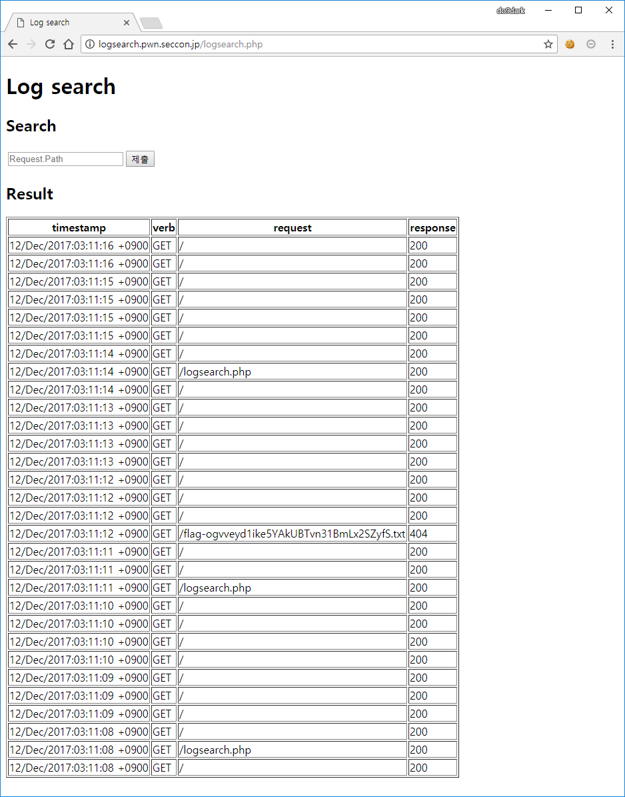
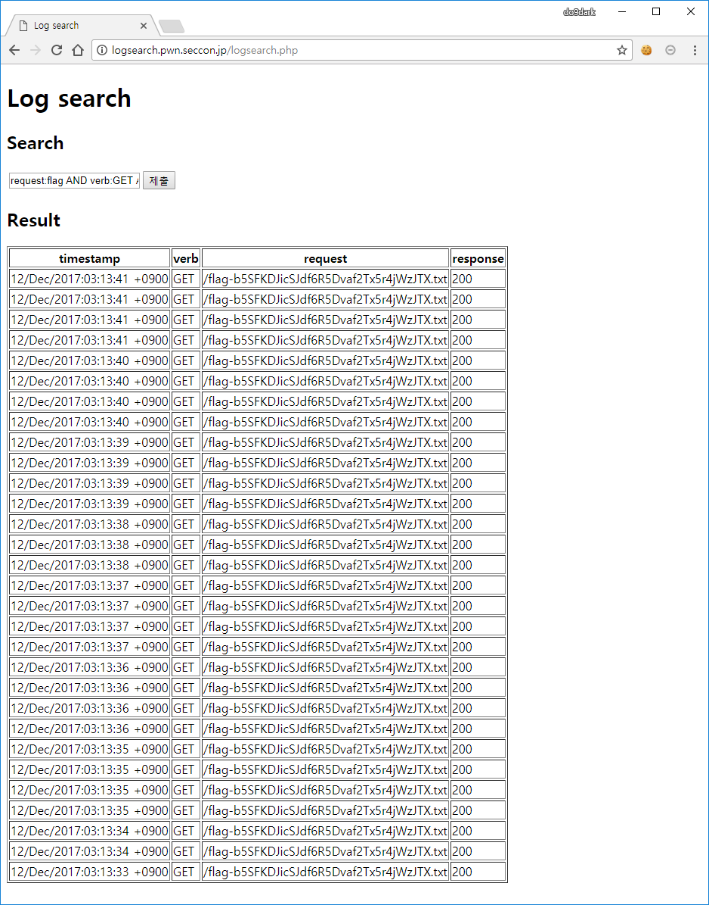
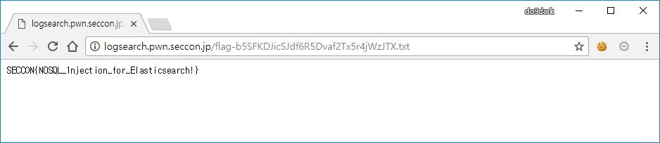

# Log search

**Description:**
> Search the flag on Elasticsearch.  
> http://logsearch.pwn.seccon.jp/

## Keyword
* Elasticsearch

## Solution
  
메인 페이지에 접근해보면 Find the flag!라는 메시지와 Log search 링크를 볼 수 있습니다.

  
Log search 링크를 눌러서 이동해보면 로그 검색 기능과 결과 화면을 볼 수 있습니다.

  
Request.Path에 `flag`를 입력하여 검색을 해보면 위와 같이 flag와 관련된 로그들이 검색되는 것을 볼 수 있습니다.  
하지만 response를 보면 404로 존재하지 않는 페이지입니다.

따라서 response가 404가 아닌 200이면서 verb는 GET, request는 flag인 결과를 얻기 위해서 다음과 같이 검색을 할 수 있습니다.  
`request:flag AND verb:GET AND response:200`

  
검색 결과 위와 같이 `flag-b5SFKDJicSJdf6R5Dvaf2Tx5r4jWzJTX.txt`가 검색된 것을 볼 수 있습니다.

  
해당 파일에 직접 접근해보면 flag를 확인할 수 있습니다.

## Flag
SECCON{N0SQL_1njection_for_Elasticsearch!}
